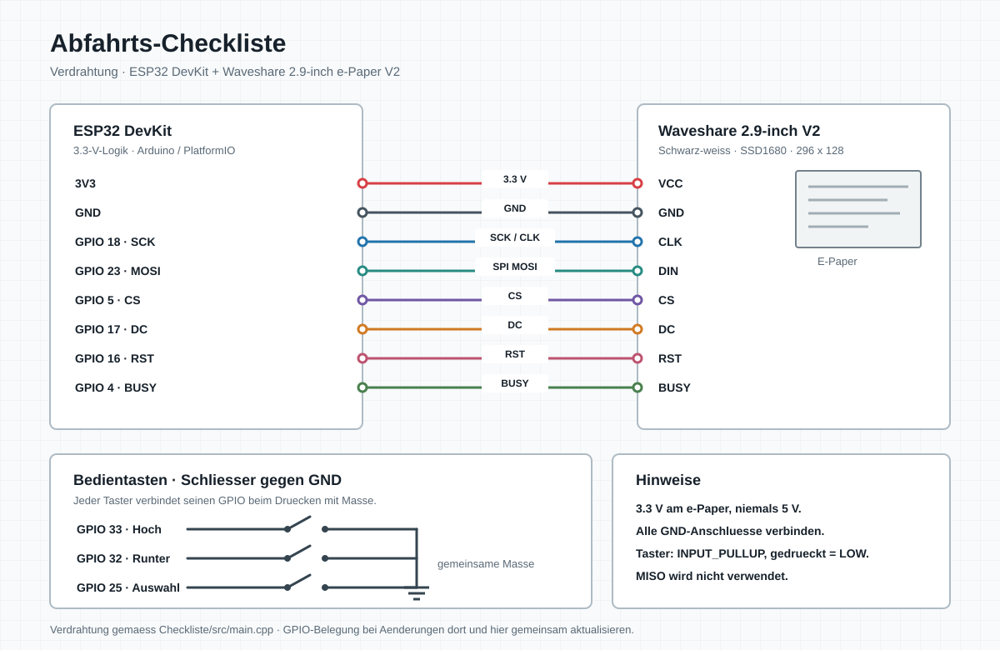

# Abfahrts-Checkliste

Eigenstaendiges PlatformIO-Projekt fuer ein ESP32-DevKit und ein
Waveshare 2.9-inch e-Paper V2 (296 x 128, schwarz/weiss, SSD1680). Die
Firmware nimmt diese Panel-Revision an; bei einer aelteren 2.9-inch-Version
muss der GxEPD2-Paneltyp angepasst werden.

## Bedienung

Mit `Hoch` und `Runter` wird der Cursor durch die Liste bewegt. Die
Navigation laeuft am Listenende weiter zum Anfang und umgekehrt. Ein kurzer
Druck auf `Auswahl` setzt oder entfernt das Haekchen des markierten Punkts.
Wird `Auswahl` 1,2 Sekunden gehalten, werden alle Haekchen geloescht und der
Cursor springt zum ersten Eintrag. Sind alle Punkte bestaetigt, erscheint
gross **OK**. Der Zustand wird nicht dauerhaft gespeichert und startet nach
einem Neustart wieder offen.

## Liste anpassen

Pruefpunkte werden in `src/main.cpp` im Array `checklist` gepflegt:

```cpp
{"Gasflasche geschlossen", false},
```

Weitere Eintraege vor der schliessenden Klammer des Arrays ergaenzen. Die
Anzeige scrollt automatisch mit dem Cursor und zeigt jeweils bis zu acht
Punkte.

## Verdrahtung



| Signal | ESP32 GPIO |
| --- | ---: |
| e-Paper CLK (ESP32 SCK) | 18 |
| e-Paper MOSI / DIN | 23 |
| e-Paper CS | 5 |
| e-Paper DC | 17 |
| e-Paper RST | 16 |
| e-Paper BUSY | 4 |
| Hoch | 33 |
| Runter | 32 |
| Auswahl / lang halten fuer Reset | 25 |

Alle Taster werden zwischen ihrem GPIO und GND angeschlossen. Die Firmware
aktiviert `INPUT_PULLUP`; ein Tastendruck ist daher LOW. Das Display wird
mit 3.3 V betrieben. Beim e-Paper-Modul die beschrifteten Anschluesse
verwenden und nicht mit 5 V versorgen.

`CLK` am Waveshare-Modul ist derselbe SPI-Takt wie `SCK` am ESP32: GPIO 18
geht an `CLK`, GPIO 23 (MOSI) geht an `DIN`. Diese beiden Leitungen nicht
vertauschen.

## Bauen und Flashen

Im Ordner `Checkliste`:

```sh
pio run
pio run --target upload
pio device monitor
```